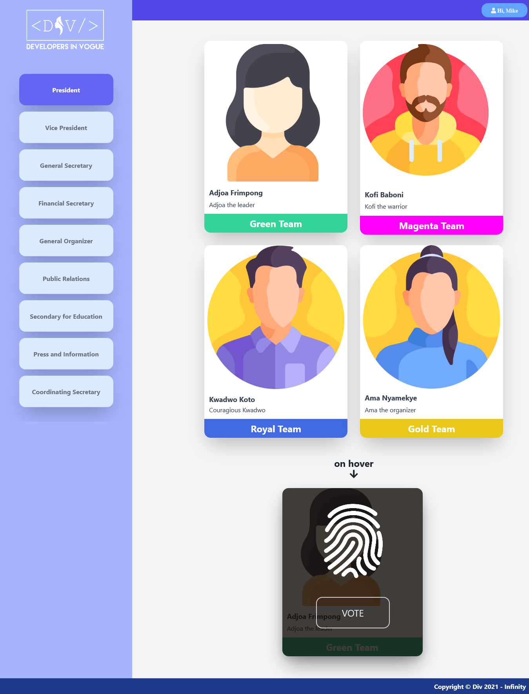

## Div-Accelator-Program-2021 Entry Exercise

- Develop an e-voting system with HTML and CSS
- The application interface should be pixel perfect. Follow the design below to produce an exact copy of the e-voting system
- When the voters hover on each candidate to vote, the button should appear as illustrated below 
- No click events are needed and No backend required, this exercise is to test your strength in HTML and CSS

## NB: All the static assets for this application can downloaded from this repository
<br>
<br>
<br>
   <a href="#"></a> <br>

<br>
<br>

## Note: You ae to create a private repository on Github to host all the source files for this repository and send an invite to @kojoyeboah53i on completion

- You can find instructions on creating a Github repository here

```  
https://docs.github.com/en/get-started/quickstart/create-a-repo 
```


- You can find instructions on sending invites to collaborators on 
a Github repository here

```
  https://docs.github.com/en/account-and-profile/setting-up-
and-managing-your-github-user-account/managing-access-to-
your-personal-repositories/inviting-collaborators-to-a-personal-repositoy

```

